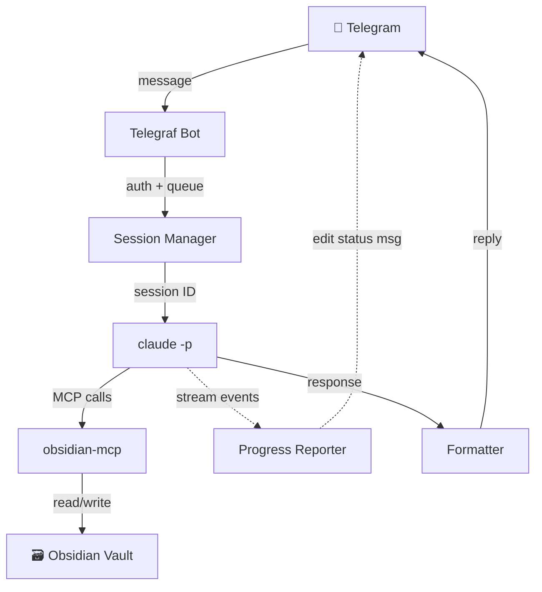
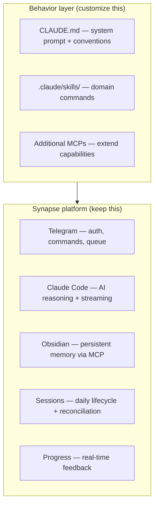
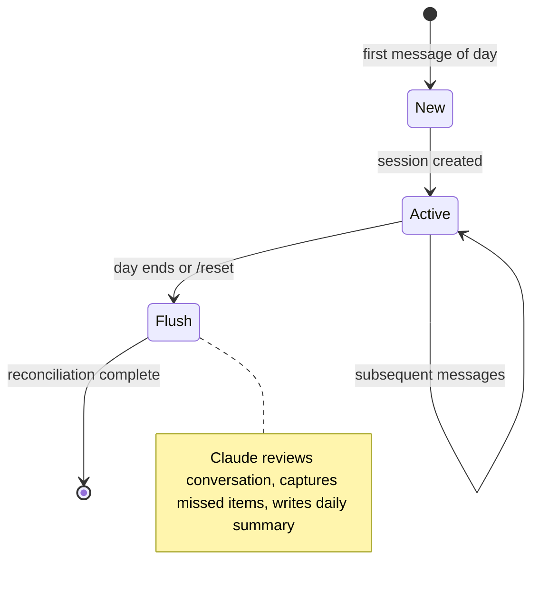
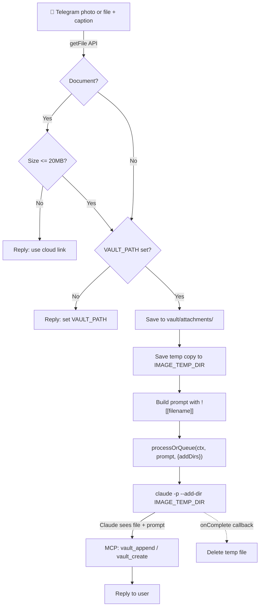
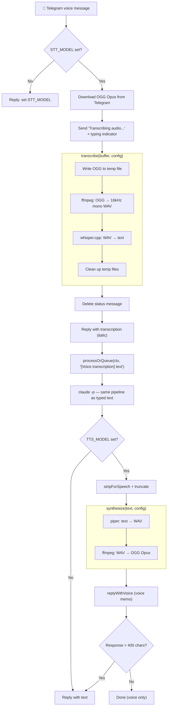

# Synapse

An extensible base agent you can build on.

<table><tr>
<td width="300">
  <br>
  <br>
  
</td>
<td valign="top">

Synapse is an extensible agent platform that combines four things into a simple but powerful base: **Claude Code** for AI reasoning, **Obsidian** as a persistent memory layer (via 16 MCP tools), **Telegram** as a conversational interface, and **session management** that gives the agent continuity across messages. Together, these form a foundation that handles the hard parts — streaming, auth, message queuing, progress feedback, reconciliation — so you can focus on what your agent actually does.

What makes each agent distinct is its **behavior layer**: a `CLAUDE.md` system prompt that defines how the agent thinks, a set of skills that define what it can do, and optionally additional MCPs that extend its capabilities. Swap these out and you have a different agent backed by the same platform.

Out of the box, Synapse ships as a **second brain** — a vault assistant you talk to from your phone that captures thoughts, searches your notes, manages tasks, files photos, and maintains your knowledge graph. But the architecture is designed for much more.

</td>
</tr></table>

## How It Works



Sessions persist throughout the day (or a configurable window), so Claude remembers earlier messages. When a session expires, Claude does a final reconciliation pass — reviewing the conversation, capturing anything missed, and appending a summary to your daily note.

## Building on Synapse

Synapse provides the runtime. Your agent provides the brain.

Three customization points:

- **CLAUDE.md** — the system prompt. Defines how the agent interprets messages, what conventions it follows, what domain knowledge it brings
- **Skills** (`.claude/skills/`) — the command set. Domain-specific actions the agent can perform
- **Additional MCPs** — extend the agent's capabilities beyond the vault (a fitness API, a calendar service, GitHub integration — whatever it needs)



Examples of what you could build:

- A **fitness tracker** — CLAUDE.md for workout logging conventions, skills for `/workout` and `/progress`, a fitness API MCP
- A **recipe assistant** — CLAUDE.md for recipe formatting, skills for `/recipe` and `/meal-plan`
- A **project manager** — CLAUDE.md for project tracking, skills for `/sprint` and `/standup`, GitHub MCP for issue integration
- A **reading log** — CLAUDE.md for book note conventions, skills for `/reading` and `/review`

Fork the repo, replace CLAUDE.md and the skills directory, optionally register additional MCPs, and you have a new agent with different expertise backed by the same platform.

## The Default Agent: Second Brain

The bundled CLAUDE.md and skills turn Synapse into a conversational interface to your Obsidian vault. Claude doesn't just search your notes — it **writes to them**. It creates notes, appends to your daily log, extracts action items, links related ideas, and maintains your knowledge graph with the same conventions you use. It's not a viewer, it's a collaborator.

And because it runs on your machine through Claude Code, there's no middleware — no extra SaaS layer, no third-party database, no additional cloud service sitting between you and your notes. Your vault, your bot, your Claude account.

Send messages to your bot on Telegram:

- **"what's on my plate today?"** — reads your daily note and outstanding tasks
- **"capture: interesting idea about X"** — appends a timestamped entry to today's daily note
- **"find: session management"** — deep search across your vault
- **"log: finished the review"** — quick timestamped log entry
- **"note: Meeting Notes — discussed project timeline"** — creates a new structured note
- **Send a photo** with a caption — Claude sees the image, saves it to your vault, and files it into the right note
- **Send a file** (PDF, document, etc.) with a caption — saved to your vault and filed into the right note
- **Send a voice message** — transcribed locally via whisper.cpp, then processed as text
- **Free-form text** — Claude uses judgment to search, capture, or act

### Bot Commands

- `/reset` — flush the current session (reconcile + capture missed items) and start fresh
- `/status` — show current session info (ID, message count, last activity)

## Quick Start

Have [Claude Code](https://docs.anthropic.com/en/docs/claude-code) installed? Run the setup wizard:

```bash
bash <(curl -sL https://raw.githubusercontent.com/jason-c-dev/synapse/main/install.sh)
```

The wizard detects your environment, installs dependencies, and walks you through configuration interactively. Safe to re-run for repairs and updates.

Already cloned the repo? Run it locally:

```bash
claude "$(cat setup.md)"
```

For manual setup, see [Prerequisites](#prerequisites) below.

## Prerequisites

- [Claude Code CLI](https://docs.anthropic.com/en/docs/claude-code) installed and authenticated
- [Obsidian MCP Server](https://github.com/jason-c-dev/obsidian-mcp) configured in your Claude Code global settings
- Node.js 20+
- A Telegram bot token (from [@BotFather](https://t.me/BotFather))
- Your Telegram user ID (from [@userinfobot](https://t.me/userinfobot))
- [whisper.cpp](https://github.com/ggerganov/whisper.cpp) + ffmpeg (optional, for voice messages) — `brew install whisper-cpp ffmpeg`
- [pipx](https://pipx.pypa.io/) (optional, for Piper TTS) — `brew install pipx` (macOS) or `apt install pipx` (Linux)
- [Piper TTS](https://github.com/rhasspy/piper) (optional, for voice replies) — `pipx install piper-tts`

## Telegram Setup

Before you can run the bot, you need a Telegram bot token and your user ID.

### Creating a Bot

1. Open Telegram and search for [@BotFather](https://t.me/BotFather) (the official Telegram tool for creating bots)
2. Send `/newbot`
3. Choose a display name (e.g. "Synapse")
4. Choose a username — must end in `bot` (e.g. `my_vault_bot`)
5. BotFather will reply with an API token — copy this for `BOT_TOKEN`

For more details, see the [Telegram Bot API documentation](https://core.telegram.org/bots#how-do-i-create-a-bot).

### Getting Your User ID

The bot is locked to specific Telegram user IDs so only you can use it. To find yours:

1. Open Telegram and search for [@userinfobot](https://t.me/userinfobot)
2. Send it any message
3. It replies with your numeric user ID — copy this for `ALLOWED_USER_IDS`

You can add multiple user IDs as a comma-separated list if you want to allow others access.

## Setup

1. Clone the repo:
   ```bash
   git clone https://github.com/jason-c-dev/synapse.git
   cd synapse
   ```

2. Install dependencies:
   ```bash
   npm install
   ```

3. Copy the example env and fill in your values:
   ```bash
   cp .env.example .env
   ```

4. Verify Claude can reach your vault:
   ```bash
   claude -p "read today's daily note" --output-format json --dangerously-skip-permissions
   ```

5. Start the bot:
   ```bash
   npm start
   ```

   Or with auto-reload during development:
   ```bash
   npm run dev
   ```

   For verbose output while debugging:
   ```bash
   npm run dev:debug
   ```

   To write debug logs to a file (useful with `tail -f synapse.log`):
   ```bash
   npm run dev:log
   ```

## Configuration

| Variable | Required | Default | Description |
|----------|----------|---------|-------------|
| `BOT_TOKEN` | Yes | — | Telegram bot token from BotFather |
| `ALLOWED_USER_IDS` | Yes | — | Comma-separated Telegram user IDs allowed to use the bot |
| `SESSION_EXPIRY` | No | `daily` | `"daily"` for day-based sessions, or a number for minutes |
| `CLAUDE_TIMEOUT` | No | `300000` | Max milliseconds to wait for Claude to respond |
| `VAULT_PATH` | For images | — | Absolute path to your Obsidian vault. Required for photo and file attachment support |
| `IMAGE_TEMP_DIR` | No | OS temp dir | Directory for temporary image files passed to Claude for analysis |
| `PROGRESS_MODE` | No | `off` | Progress feedback during Claude processing: `off` (typing indicator only), `standard` (acknowledgment + generic activity labels), `detailed` (tool names, inputs, and cost summary) |
| `QUEUE_DEPTH` | No | `3` | Maximum queued messages per user. Messages beyond this limit are rejected |
| `LOG_LEVEL` | No | `info` | Logging verbosity: `error`, `warn`, `info`, or `debug` |
| `STT_PATH` | No | `whisper-cli` | Path to whisper.cpp binary for voice transcription |
| `STT_MODEL` | For voice | — | Path to GGML model file. Required to enable voice message support |
| `AUDIO_TEMP_DIR` | No | OS temp dir | Directory for temporary audio files during transcription |
| `TTS_PATH` | No | `piper` | Path to Piper TTS binary |
| `TTS_MODEL` | For voice replies | — | Path to Piper ONNX model. Enables voice memo replies |
| `TTS_VOICE_THRESHOLD` | No | `400` | Max chars for voice-only reply (longer gets voice + text) |
| `LOG_FILE` | No | — | Path to a log file. When set, all output is appended here in addition to the console |

## Session Management

Sessions give Claude conversational memory across messages:

- **First message of the day** starts a new session
- **Subsequent messages** resume the same session, so Claude remembers context
- **Session expiry** triggers a reconciliation pass where Claude reviews the conversation, captures anything missed, and writes a summary to your daily note
- **`/reset`** manually triggers a flush and starts a new session



## Attachments

Photos and documents follow the same dual-write pattern: the file is saved to the vault for permanent storage, and a temp copy is passed to Claude via `--add-dir` so it can see the file during processing. Claude handles the caption as a normal message with the attachment available for analysis.



**Photos** are compressed by Telegram before delivery. The bot generates a random filename (`telegram-YYYY-MM-DD-abcd1234.jpg`) since Telegram doesn't provide the original name. Claude can see and analyze the image content.

**Documents** (PDFs, spreadsheets, etc.) preserve the original filename with a date prefix (`2026-03-06-report.pdf`). A 20MB size check enforces the Telegram Bot API download limit — oversized files get a reply suggesting a cloud link instead. Claude can't see document contents visually but can reference the embed in notes.

Why not use the MCP server's `vault_attachment` tool and let Claude handle everything? Because that would require base64-encoding the file into Claude's prompt, bloating context with kilobytes of encoded data on every attachment. Instead, the bot saves the file directly to the vault and passes a temp copy via `--add-dir` so Claude can see it without the base64 overhead. Claude gets the content, the vault gets the file, and the context window stays clean.

The temp copy exists only for the duration of Claude's processing. The `onComplete` callback in `processOrQueue` deletes it after Claude responds, so `IMAGE_TEMP_DIR` stays clean. The vault copy is permanent.

## Voice Handling

Voice messages are transcribed locally, then the text feeds into the same message pipeline as typed text. There's no special routing — Claude handles intent detection the same way for voice and text.



The transcription pipeline in `src/transcribe.js` is backend-agnostic. The public interface is `transcribe(buffer, config) → string`. Internally, it handles format conversion (OGG Opus → WAV) and temp file lifecycle regardless of which STT engine runs. The whisper.cpp backend is one function — to add sherpa-onnx or another engine, add a new backend function and a config key to select it.

Voice is opt-in: if `STT_MODEL` is not set, the bot works normally for text and photos and replies with setup instructions on voice messages. At startup, `checkTranscriptionDeps()` logs whether voice is enabled and warns about missing dependencies (ffmpeg, whisper binary, model file) without blocking the bot from starting.

When TTS is enabled (`TTS_MODEL` set), the bot replies to voice messages with voice memos. Short responses (<=400 chars of stripped text) are sent as voice only — the audio is the full reply. Longer responses get a spoken summary of the first paragraph followed by the full text. This keeps the conversational feel of voice without losing detail on rich responses. If TTS fails for any reason, the bot falls back to text silently.

### Enabling Voice

Voice requires [whisper.cpp](https://github.com/ggerganov/whisper.cpp) and ffmpeg. On macOS:

```bash
brew install whisper-cpp ffmpeg
```

Download a model (~150MB):

```bash
mkdir -p /opt/homebrew/share/whisper-cpp/models
curl -L --progress-bar -o /opt/homebrew/share/whisper-cpp/models/ggml-base.en.bin \
  https://huggingface.co/ggerganov/whisper.cpp/resolve/main/ggml-base.en.bin
```

Add to `.env` and restart:

```
STT_MODEL=/opt/homebrew/share/whisper-cpp/models/ggml-base.en.bin
# STT_PATH=whisper-cli  # default works for Homebrew
```

The bot logs voice status at startup. Send a voice message to test — you'll see the transcription in italics before Claude responds.

### Enabling Voice Replies

Voice replies use [Piper TTS](https://github.com/rhasspy/piper) for neural text-to-speech. Install Piper:

```bash
pipx install piper-tts
pipx inject piper-tts pathvalidate   # missing upstream dependency
```

Download a voice model — preview voices at [piper.ttstool.com](https://piper.ttstool.com):

```bash
mkdir -p ~/.piper/models
curl -L -o ~/.piper/models/en_US-amy-medium.onnx \
  'https://huggingface.co/rhasspy/piper-voices/resolve/main/en/en_US/amy/medium/en_US-amy-medium.onnx'
curl -L -o ~/.piper/models/en_US-amy-medium.onnx.json \
  'https://huggingface.co/rhasspy/piper-voices/resolve/main/en/en_US/amy/medium/en_US-amy-medium.onnx.json'
```

Add to `.env` and restart:

```
TTS_MODEL=~/.piper/models/en_US-amy-medium.onnx
```

## Project Structure

```
├── CLAUDE.md          # System prompt, vault behavior, and MCP tool patterns
├── .env.example       # Environment variable template
├── package.json       # ESM, single dependency (telegraf)
├── src/
│   ├── bot.js         # Entry point: Telegraf, auth, commands, message handler
│   ├── claude.js      # Spawns claude -p with session management flags
│   ├── session.js     # Session lifecycle: create, resume, expire, flush
│   ├── transcribe.js  # Speech-to-text pipeline (pluggable, default: whisper.cpp)
│   ├── tts.js         # Text-to-speech pipeline (Piper TTS → OGG Opus)
│   ├── config.js      # Env loading and validation
│   ├── format.js      # Obsidian markdown → Telegram formatting, message splitting
│   ├── progress.js    # Progress reporting: status messages, throttled edits, mode-aware formatting
│   ├── queue.js       # Per-user message queue with depth limits
│   └── log.js         # Leveled logger (error/warn/info/debug)
└── .claude/
    └── skills/        # Claude Code skill definitions (capture, find, log, complete-tasks, edit, etc.)
```

## Why `claude -p` and Not the Agent SDK

Synapse uses `claude -p` (Claude Code's prompt mode) rather than the Anthropic Agent SDK. Telegram is just the transport layer — each message is passed to Claude as if you were talking to it directly, with session flags for conversational memory.

This is a deliberate choice:

- **Fixed cost** — runs on Anthropic's Max plan (flat monthly fee), no per-token API charges. For personal use, this is significantly cheaper than the API
- **No API key required** — Claude Code authenticates via your subscription, not an API key
- **Terms-compliant** — stays on the right side of Anthropic's acceptable use for personal, non-commercial automation via Claude Code
- **Good enough for async chat** — response latency is acceptable for a Telegram bot where you're not expecting sub-second replies

**Roadmap: Agent SDK support.** For business and commercial use cases, a future version will support the Anthropic Agent SDK as an alternative invocation backend. This would provide faster responses through long-running sessions and streaming, but at higher cost (per-token API pricing). The invocation layer is largely isolated in `claude.js`, though session management (`session.js`) is currently coupled to `claude -p`'s CLI session model and would also need adapting.

## Design Decisions

- **Plain JavaScript, ESM, no build step** — simple wrapper, fast iteration
- **Single dependency** (Telegraf) — .env is parsed manually in config.js, no dotenv package, no TypeScript, no framework
- **Long polling** — personal bot running locally, no public URL needed for webhooks
- **`claude -p` over Agent SDK** — fixed-cost Max plan for personal use; Agent SDK on the roadmap for commercial deployments (see above)
- **`--dangerously-skip-permissions`** — required for non-interactive MCP tool use in `claude -p` mode
- **Legacy Markdown** for Telegram — MarkdownV2 requires escaping 18 special characters; legacy mode is forgiving enough for this use case
- **Vault is the database** — no SQLite, no Redis. Session state is one small JSON file; all real data lives in Obsidian
- **Configurable progress updates** — three modes (`off`/`standard`/`detailed`) control how much feedback the user sees during Claude processing. `off` preserves silent behavior for derived bots targeting non-technical users. `detailed` streams tool call names and inputs for power users. Progress uses a single editable Telegram message (send once, edit in place) to avoid chat clutter, with throttled edits (~1/second) to respect Telegram rate limits
- **Per-user message queue** — instead of rejecting messages while processing, queues them (up to `QUEUE_DEPTH`) and processes sequentially. Different users can process concurrently
- **Voice transcription is pluggable** — `src/transcribe.js` defines a `transcribe(buffer, config)` interface with whisper.cpp as the default backend. Alternative engines (sherpa-onnx, etc.) can be added without touching the bot layer. Transcribed text feeds into the same message pipeline as typed text — no special routing
- **Voice replies are length-aware** — when the user sends a voice memo and TTS is enabled, short responses (<=400 chars) are returned as voice only. Longer responses get a spoken summary of the first paragraph plus the full text. The bot decides based on response length, not Claude — no extra API call needed
- **Attachments bypass Claude's context** — photos and documents are saved directly to the vault, with a temp copy passed via `--add-dir` so Claude can see the file without base64 bloating the prompt
- **Leveled logging** — `LOG_LEVEL` controls verbosity; `debug` streams Claude's stderr in real-time and logs spawn args, response previews, and exit codes. `LOG_FILE` optionally writes all output to a file for `tail -f` debugging

## Related

- [Obsidian MCP Server](https://github.com/jason-c-dev/obsidian-mcp) — the MCP server that gives Claude access to your vault
- [Claude Code](https://docs.anthropic.com/en/docs/claude-code) — the CLI that powers the Claude invocations

## License

MIT
