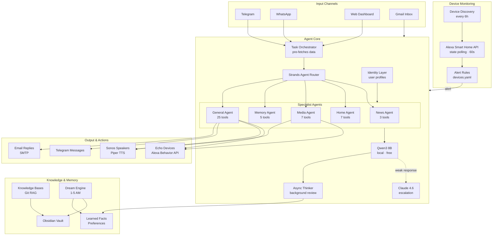
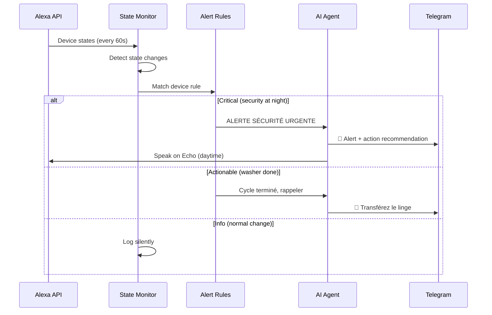
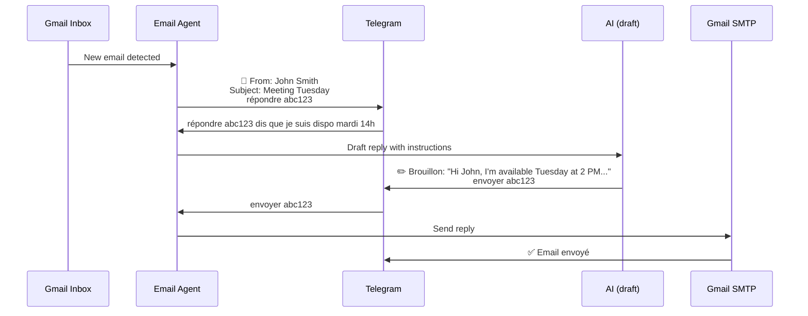

# Vertex Nova

<p align="center">
  
</p>

<p align="center">
  A self-hosted, multi-agent home assistant powered by local AI.<br/>
  Monitors your smart home, manages your emails, talks on your Echo and Sonos, and learns about you over time.
</p>

---

## Architecture



## Quick Start

```bash
curl -fsSL https://raw.githubusercontent.com/sdpoueme/vertex-nova/main/install.sh | bash
```

Or manually: `git clone`, `npm install`, `cp .env.home.example .env`, edit credentials, `npm start`.
Full guide: [docs/INSTALL.md](docs/INSTALL.md).

## Features

| Feature | Description |
|---------|-------------|
| Multi-Agent System | 6 specialist agents via Strands SDK, each with 3-7 tools for faster inference |
| Telegram & WhatsApp | Text, voice (whisper.cpp), images (Gemma 4 vision) |
| Web Dashboard | HTTPS, multimodal chat, device monitoring, config editor, live device states |
| Echo Devices | Native Alexa Behavior API — speak directly, no Voice Monkey needed |
| Sonos TTS | Piper TTS (offline FR/EN), auto token refresh |
| Email Agent | Inbox monitoring, Telegram notifications, AI-drafted replies, approval workflow, SMTP sending |
| Smart Home Monitor | Alexa API device discovery + state polling, context-driven alert rules |
| Task Orchestrator | Pre-fetches news/weather/movies for device requests (1 AI call instead of 3+) |
| Async Thinker | Background agent reviews every response and saves learnings |
| Identity Layer | Per-user profiles, automatic fact extraction, topic tracking |
| Knowledge Bases | Git-synced repos with relationship-aware RAG |
| Dream Engine | Nightly self-improvement: conversation review, memory consolidation, weekly summaries |
| Movie Recommendations | TMDB + NYT, multi-language, scored by user genre preferences |
| Proactive Actions | Scheduled news, weather, maintenance, movies — persistent across restarts |
| Night Mode | Voice devices blocked 10 PM – 7 AM, auto-routes to Telegram |

## Smart Home Monitoring

Devices are discovered automatically via the Alexa Smart Home API every 6 hours. The agent polls device states every 60 seconds and applies user-defined alert rules.



Each device rule includes an AI context field — specific instructions for what the agent should do when that device changes state. Examples:

| Device | Rule |
|--------|------|
| 🔒 Security Panel | Night disarm = urgent alert. Repeated arm/disarm = suspicious. |
| 📹 Backyard Camera | Night motion = immediate alert. Weekday day = probably delivery, skip. |
| 👕 Washer | Cycle done → remind to transfer. No dryer activity in 30 min → second reminder. |
| 🧊 Fridge | Temp > 8°C = urgent. Suggest checking door, offer to draft email to Bosch support. |
| 🍳 Oven | On > 2 hours → reminder. On after 11 PM → safety alert. |
| 🔌 Front Door Socket | Off at night → suggest turning on for security. |

## Email Agent



## Cookie Expiry Handling

When Alexa cookies expire, the agent automatically:
1. Detects the 401/403 error
2. Stops device polling
3. Sends you a Telegram message with the cookie format
4. When you paste the new cookies, updates `.env` and restarts monitoring

## AI Tools (25)

| Category | Tools |
|----------|-------|
| Voice | `sonos_speak`, `sonos_chime`, `sonos_volume`, `sonos_rooms`, `echo_speak`, `echo_speak_all` |
| Search | `news_search`, `web_search`, `web_fetch`, `movie_recommend` |
| Vault | `vault_read`, `vault_search`, `vault_create`, `vault_append`, `vault_list` |
| Memory | `memory_view`, `memory_write`, `memory_append`, `reminder_set`, `reminder_list` |
| Knowledge | `kb_search`, `kb_list` |
| Email | `email_list`, `email_draft`, `email_send` |

## Web Dashboard

Served over HTTPS (auto-generated self-signed cert). Access: `https://<your-ip>:3080`

| Panel | Features |
|-------|----------|
| Accueil | Live device status (security/appliances/other), channels, KBs, Alexa summary, interactions |
| Chat | Text, image upload, voice recording, interaction history |
| Configuration | AI models, Sonos/Echo routing, home location, news, movies, Alexa cookies, Telegram multi-user |
| Appareils | Alexa device discovery, live states, alert rule editor with device picker |
| Connaissances | Knowledge base management with forms and YAML editor |
| Logs | Live tail of agent logs |

## Offline Capability

Everything runs locally without any cloud API:

| Feature | Local Stack |
|---------|------------|
| Text chat | Qwen3 8B (Ollama) |
| Voice input | whisper.cpp |
| Voice output | Piper TTS → Sonos |
| Image analysis | Gemma 4 E2B (Ollama) |
| Search | DuckDuckGo / Google News RSS |
| All 25 tools | Work on Qwen3 via Strands |

Claude is only used for escalation when the local model gives a weak response, and has a 30-minute cooldown if credits run out.

## Configuration

| File | Purpose |
|------|---------|
| `.env` | All credentials and settings |
| `agent.md` | Agent persona, rules, household info |
| `config/routing.yaml` | Model routing rules |
| `config/proactive.yaml` | Scheduled proactive actions |
| `config/knowledgebases.yaml` | Knowledge base git repos |
| `config/devices.yaml` | Device alert rules |

## Installation

See [docs/INSTALL.md](docs/INSTALL.md) for the full guide.

Prerequisites: Node 20+, Ollama, ffmpeg, openssl.
Optional: Piper TTS (Sonos voice), whisper.cpp (voice messages).

```bash
npm install
ollama pull qwen3:8b
cp .env.home.example .env  # Edit with your credentials
npm start
# Dashboard at https://localhost:3080
```

## License

MIT
