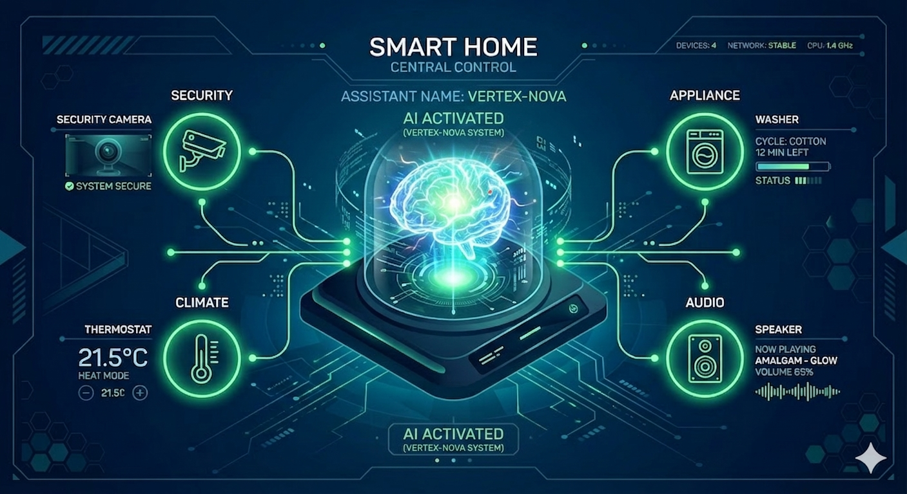
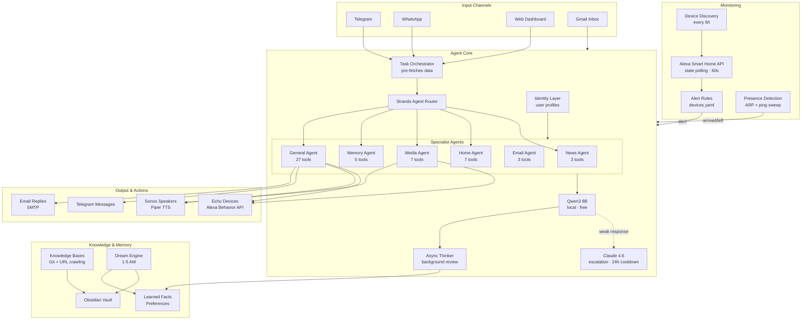
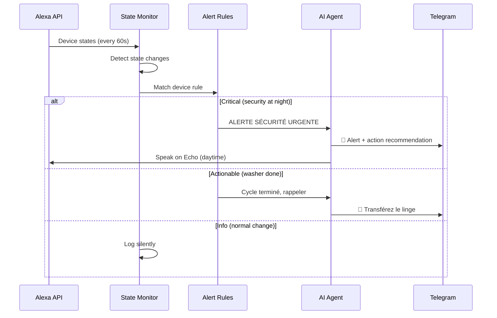
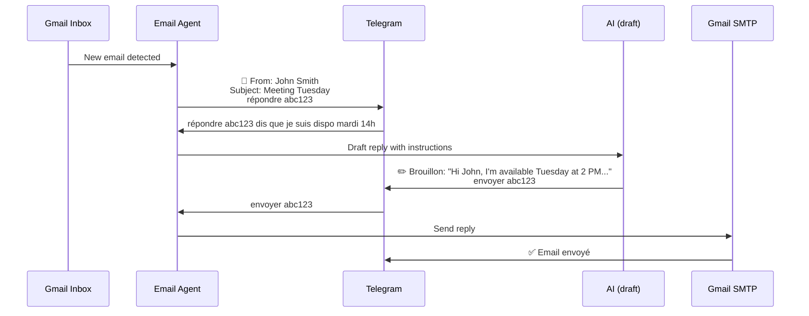

# Vertex Nova

<p align="center">
  
</p>

<p align="center">
  A self-hosted, multi-agent home assistant powered by local AI.<br/>
  Monitors your smart home, manages your emails, talks on your Echo and Sonos, and learns about you over time.
</p>

---

## Architecture



## Quick Start

```bash
curl -fsSL https://raw.githubusercontent.com/sdpoueme/vertex-nova/main/install.sh | bash
```

Or manually: `git clone`, `npm install`, `cp .env.home.example .env`, edit credentials, `npm start`.
Full guide: [docs/INSTALL.md](docs/INSTALL.md).

## Features

| Feature | Description |
|---------|-------------|
| Multi-Agent System | 7 specialist agents (news, home, media, memory, email, weather, general) via Strands SDK |
| Telegram & WhatsApp | Text, voice (whisper.cpp with hallucination filtering), images (two-stage vision pipeline) |
| Web Dashboard | HTTPS, multimodal chat with voice mode toggle + device selector, config editor |
| Echo Devices | Native Alexa Behavior API — speak directly on any Echo, auto-discovered |
| Sonos TTS | Piper TTS (offline FR/EN), auto token refresh, time-based room routing |
| Email Agent | Inbox monitoring, Telegram notifications, AI-drafted replies, compose new emails, SMTP |
| Smart Home Monitor | Alexa API device discovery + state polling, context-driven alert rules per device |
| Presence Detection | Per-person WiFi tracking via ARP + ping sweep, configurable thresholds, vacation mode toggle |
| Task Orchestrator | Pre-fetches news/weather/movies for device requests (1 AI call instead of 3+) |
| Async Thinker | Background agent reviews every response and saves learnings |
| Identity Layer | Per-user profiles, automatic fact extraction, topic tracking |
| Knowledge Bases | Git repos + URL crawling (sitemap discovery, link extraction, up to 50 pages/site) |
| Image Queue | Failed vision requests saved to disk, auto-retried when Claude comes back online |
| Dream Engine | Nightly self-improvement: conversation review, memory consolidation, weekly summaries |
| Movie Recommendations | TMDB + NYT, multi-language, scored by user genre preferences |
| Proactive Actions | Scheduled news, weather, maintenance, movies — persistent across restarts |
| Night Mode | Voice devices blocked 10 PM – 7 AM, auto-routes to Telegram |
| Claude Cooldown | 24h cooldown on credit errors, persisted to disk across restarts |

## Smart Home Monitoring

Devices are discovered automatically via the Alexa Smart Home API every 6 hours. The agent polls device states every 60 seconds and applies user-defined alert rules.



Each device rule includes an AI context field — specific instructions for what the agent should do when that device changes state. Examples:

| Device | Rule |
|--------|------|
| 🔒 Security Panel | Night disarm = urgent alert. Repeated arm/disarm = suspicious. |
| 📹 Backyard Camera | Night motion = immediate alert. Weekday day = probably delivery, skip. |
| 👕 Washer | Cycle done → remind to transfer. No dryer activity in 30 min → second reminder. |
| 🧊 Fridge | Temp > 8°C = urgent. Suggest checking door, offer to draft email to Bosch support. |
| 🍳 Oven | On > 2 hours → reminder. On after 11 PM → safety alert. |
| 🔌 Front Door Socket | Off at night → suggest turning on for security. |

## Presence Detection

Tracks who's home by scanning the local network for known phone MAC addresses. Each person has their own welcome preferences, language, and notification settings.

- **Per-person config** in `config/presence.yaml`: language, welcome style, welcome device (Sonos/Echo), notification preference (Telegram, voice, or both)
- ARP table polling every 30 seconds + ping sweep every ~2.5 minutes (works with mesh WiFi pods)
- Smart thresholds: 15 minutes during day, 60 minutes at night to avoid false positives from phone sleep mode
- Requires 2 consecutive missed polls before marking as "left"
- Night suppression: departures during night hours are logged silently (no notification)
- Morning check: if someone "left" at night and hasn't returned by 7 AM → alert
- Travel detection: after 6 hours away → asks "are you traveling?" via Telegram
- Vacation mode: auto-enables when all residents away 24h+, enhanced security monitoring. Can also be toggled manually from the dashboard or via Telegram ("oui voyage" / "fin voyage")
- Arrival: notification per person's preference + AI welcome greeting on their configured device
- All thresholds (day/night away time, night hours, travel ask delay, vacation delay, consecutive misses) are tunable from the dashboard
- Dashboard widget with real-time presence + vacation mode toggle
- AI tool `who_is_home` for conversational queries

Configure in the dashboard (Configuration → Détection de présence) or `config/presence.yaml`:
```yaml
settings:
  poll_seconds: 30
  day_away_minutes: 15
  night_away_minutes: 60
  consecutive_misses: 2
  travel_ask_hours: 6
  vacation_hours: 24
  night_start: 23
  night_end: 7

people:
  - name: Serge
    mac: 6c:3a:ff:8a:06:ed
    language: fr
    welcome_style: briefing        # simple, briefing, activity_summary
    welcome_room: Rez de Chaussee  # Sonos room or echo:Device Name
    notifications: both            # telegram, voice, both
```
Get MAC addresses from `arp -a` or your router admin page. For phones using randomized MACs (iOS/Android), use the WiFi-specific MAC shown in the phone's WiFi settings.

Backward compatible: if `config/presence.yaml` doesn't exist, falls back to `PRESENCE_DEVICES` env var.

## Knowledge Bases

Two types of knowledge bases, configurable from the dashboard:

| Type | Source | How it works |
|------|--------|-------------|
| Git repo | GitHub/GitLab URL | Clones repo, extracts text from HTML/JSON/MD, relationship-aware for genealogy |
| URL collection | List of websites | Discovers pages via sitemap.xml (or link extraction fallback), fetches up to 50 pages/site, runs in background worker process |

URL crawling runs in a child process to avoid blocking the main event loop.

## Email Agent



## Two-Stage Vision Pipeline

When you send an image:
1. **Vision Agent** (Gemma 4 E2B) analyzes the image → produces a text description (~10-30s)
2. **Text Agent** (Qwen3 8B) interprets the description and takes action if needed
3. Both results are combined and returned

If the user requests an action ("analyse ce plan et sauvegarde-le"), Stage 2 uses tools (vault, email, reminders). For simple analysis ("décris cette image"), only Stage 1 runs.

If both Claude and the local vision model fail, the request is queued to disk and auto-retried every 15 minutes.

## Anti-Hallucination

The system prompt explicitly forbids inventing content: "N'INVENTE JAMAIS de contenu. Pour les films, actualités, météo: utilise TOUJOURS les outils." This prevents the AI from generating fake movie titles, fake news, or fake data instead of calling the appropriate tool.

A degeneration detector catches repeated word loops (a known Qwen3 bug) and truncates the response to the first coherent sentences.

## Cookie Expiry Handling

When Alexa cookies expire, the agent automatically:
1. Detects the 401/403 error
2. Stops device polling
3. Sends you a Telegram message with the cookie format
4. When you paste the new cookies, updates `.env` and restarts monitoring

## AI Tools (27)

| Category | Tools |
|----------|-------|
| Voice | `sonos_speak`, `sonos_chime`, `sonos_volume`, `sonos_rooms`, `echo_speak`, `echo_speak_all` |
| Search | `news_search`, `web_search`, `web_fetch`, `movie_recommend` |
| Vault | `vault_read`, `vault_search`, `vault_create`, `vault_append`, `vault_list` |
| Memory | `memory_view`, `memory_write`, `memory_append`, `reminder_set`, `reminder_list` |
| Knowledge | `kb_search`, `kb_list` |
| Email | `email_list`, `email_draft`, `email_send`, `email_compose` |
| Presence | `who_is_home` |

## Web Dashboard

Served over HTTPS (auto-generated self-signed cert). Access: `https://<your-ip>:3080`

| Panel | Features |
|-------|----------|
| Accueil | Live device status, presence widget, channels, KBs, recent interactions |
| Chat | Text, image upload, voice recording, voice mode toggle + device selector, interaction history |
| Configuration | AI models, Sonos/Echo routing (auto-discovered devices), per-person presence (welcome style, device, language, notifications, detection thresholds, vacation toggle), home location, news, movies, Alexa cookies, Telegram multi-user |
| Appareils | Alexa device discovery with capabilities, alert rule editor with device picker from discovered list |
| Connaissances | Git repos + URL collections, sitemap crawling, sync per KB |
| Logs | Live tail of agent logs |

## Offline Capability

Everything runs locally without any cloud API:

| Feature | Local Stack |
|---------|------------|
| Text chat | Qwen3 8B (Ollama) |
| Voice input | whisper.cpp |
| Voice output | Piper TTS → Sonos |
| Image analysis | Gemma 4 E2B (Ollama) → Qwen3 8B for follow-up actions |
| Search | DuckDuckGo / Google News RSS |
| All 27 tools | Work on Qwen3 via Strands |

Claude is only used for escalation when the local model gives a weak response. On credit errors, it enters a 24-hour cooldown persisted to disk — no wasted API calls across restarts.

## Configuration

| File | Purpose |
|------|---------|
| `.env` | All credentials and settings |
| `agent.md` | Agent persona, rules, household info |
| `config/routing.yaml` | Model routing rules |
| `config/proactive.yaml` | Scheduled proactive actions |
| `config/knowledgebases.yaml` | Knowledge base git repos |
| `config/devices.yaml` | Device alert rules |
| `config/presence.yaml` | Per-person presence detection settings and thresholds |

## Installation

See [docs/INSTALL.md](docs/INSTALL.md) for the full guide.

Prerequisites: Node 20+, Ollama, ffmpeg, openssl.
Optional: Piper TTS (Sonos voice), whisper.cpp (voice messages).

```bash
npm install
ollama pull qwen3:8b
cp .env.home.example .env  # Edit with your credentials
npm start
# Dashboard at https://localhost:3080
```

## License

MIT
