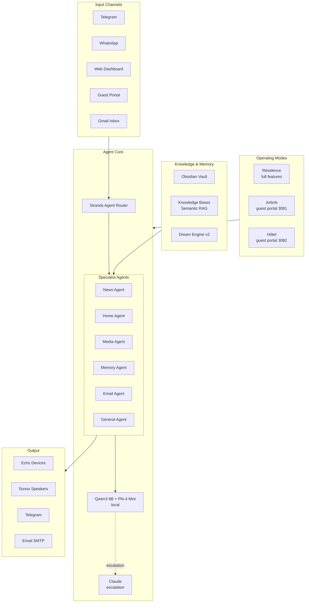

# Vertex Nova

<p align="center">
  
</p>

<p align="center">
  A self-hosted, multi-agent home assistant powered by local AI.<br/>
  Runs in three modes: family residence, Airbnb rental, or multi-room hotel.
</p>

---

## Quick Start

```bash
curl -fsSL https://raw.githubusercontent.com/sdpoueme/vertex-nova/main/install.sh | bash
```

Or manually: `git clone`, `npm install`, `cp .env.home.example .env`, edit credentials, `npm start`.

Full installation guide: [docs/INSTALL.md](docs/INSTALL.md)

---

## Operating Modes

Vertex Nova adapts its entire behavior based on the active mode. The core system (AI, devices, dashboard) is shared, but each mode activates different features, routing, and privacy rules.

| Mode | Port | Use case | Key features |
|------|------|----------|--------------|
| **Résidence** | 3080 | Family home (default) | Full assistant, presence, dream engine, family identity, email, knowledge bases |
| **Airbnb** | 3080 + 3081 | Short-term rental | Guest portal, access codes, limited device control, privacy isolation |
| **Hôtel** | 3080 + 3082 | Multi-room with individual guests | Per-room management, guest enrollment, welcome emails, occupancy tracking |

Switch modes from the dashboard (Configuration → Hospitalité) or via API. The system reloads routing, proactive actions, and dashboard layout automatically.

---

## Documentation

| Document | Content |
|----------|---------|
| [docs/INSTALL.md](docs/INSTALL.md) | Full installation guide (prerequisites, channels, auto-start) |
| [docs/MODE-RESIDENCE.md](docs/MODE-RESIDENCE.md) | Residence mode — family features, presence, dream engine, identity |
| [docs/MODE-HOSPITALITY.md](docs/MODE-HOSPITALITY.md) | Hospitality modes — Airbnb & Hotel guest management |
| [docs/ALEXA-INTEGRATION.md](docs/ALEXA-INTEGRATION.md) | Alexa Smart Home API integration details |
| [docs/INSTALLATION-FR.md](docs/INSTALLATION-FR.md) | Guide d'installation en français |

---

## Architecture


```mermaid
graph TB
    subgraph Input["Input Channels"]
        TG[Telegram]
        WA[WhatsApp]
        WEB[Web Dashboard]
        GUEST[Guest Portal]
        EMAIL_IN[Gmail Inbox]
    end

    subgraph Core["Agent Core"]
        ROUTER[Strands Agent Router]
        subgraph Agents["Specialist Agents"]
            NEWS[News Agent]
            HOME[Home Agent]
            MEDIA[Media Agent]
            MEM[Memory Agent]
            EMAIL[Email Agent]
            GEN[General Agent]
        end
        OLLAMA[Qwen3 8B + Phi-4 Mini<br/>local]
        CLAUDE[Claude<br/>escalation]
    end

    subgraph Output["Output"]
        ECHO[Echo Devices]
        SONOS[Sonos Speakers]
        TG_OUT[Telegram]
        EMAIL_OUT[Email SMTP]
    end

    subgraph Knowledge["Knowledge & Memory"]
        VAULT[Obsidian Vault]
        KB[Knowledge Bases<br/>Semantic RAG]
        DREAM[Dream Engine v2]
    end

    subgraph Modes["Operating Modes"]
        RES[Résidence<br/>full features]
        AIR[Airbnb<br/>guest portal 3081]
        HOT[Hôtel<br/>guest portal 3082]
    end

    Input --> ROUTER
    ROUTER --> Agents
    Agents --> OLLAMA
    OLLAMA -.->|escalation| CLAUDE
    Agents --> Output
    Knowledge --> Agents
    Modes -->|config| Core
```

---

## Core Features (All Modes)

| Feature | Description |
|---------|-------------|
| Multi-Agent System | 7 specialist agents via Strands SDK |
| Web Dashboard | HTTPS, Cloudscape UI, mode-aware layout |
| Echo Devices | Alexa Behavior API — speak on any Echo |
| Sonos TTS | Piper TTS (offline FR/EN), time-based room routing |
| Smart Home Monitor | Alexa API device discovery + state polling, alert rules |
| Model Router | Pattern-based routing to different AI models |
| Proactive Actions | Scheduled tasks (mode-specific config) |
| Offline First | Everything runs locally without cloud APIs |

---

## Mode: Résidence

The default mode — a full-featured family assistant. See [docs/MODE-RESIDENCE.md](docs/MODE-RESIDENCE.md) for details.

Key features:
- **Family Identity** — per-person tone, schedule, notification preferences
- **Presence Detection** — WiFi tracking, arrivals/departures, vacation mode
- **Dream Engine** — nightly self-improvement (ACU, policies, graph consolidation)
- **Email Agent** — inbox monitoring, AI-drafted replies, compose
- **Knowledge Bases** — Git repos + URL crawling, semantic RAG
- **Session Bootstrap** — cross-session memory persistence
- **27 AI Tools** — voice, search, vault, memory, email, presence

---

## Mode: Airbnb

Transforms the system into a guest concierge for short-term rentals. See [docs/MODE-HOSPITALITY.md](docs/MODE-HOSPITALITY.md).

Key features:
- **Guest Portal** on port 3081 (Cloudscape UI, isolated from admin)
- **Access code** authentication (6-char, emailed to guest, auto-expires at checkout)
- **Multi-language** — agent auto-detects guest language
- **Limited access** — guest sees WiFi, rules, local info, chat only
- **Privacy** — guest conversations never visible in admin dashboard
- **Dream engine disabled** — no background processing during guest stays

---

## Mode: Hôtel

Multi-room management with individual guest enrollment. See [docs/MODE-HOSPITALITY.md](docs/MODE-HOSPITALITY.md).

Key features:
- **Room cards** with occupancy tracking, nights remaining, checkout warnings
- **Guest enrollment** — name, email, language, dates, welcome email
- **Guest Portal** on port 3082 (login with name + room name)
- **Per-room devices** — each room has assigned Echo/Sonos speakers
- **Welcome emails** — automatic with portal URL, WiFi, room info
- **Privacy** — guest interactions isolated from admin view

---

## Configuration

| File | Purpose |
|------|---------|
| `.env` | Credentials and settings |
| `agent.md` | Agent persona and rules |
| `config/routing.yaml` | Model routing (residence) |
| `config/routing-hospitality.yaml` | Model routing (hospitality modes) |
| `config/proactive.yaml` | Proactive actions (residence) |
| `config/proactive-hospitality.yaml` | Proactive actions (hospitality) |
| `config/hospitality.yaml` | Hospitality config (rooms, guests, info) |
| `config/family.yaml` | Family identity |
| `config/presence.yaml` | Presence detection |
| `config/devices.yaml` | Device alert rules |
| `config/knowledgebases.yaml` | Knowledge bases |
| `config/dream-layer.yaml` | Dream Engine parameters |

---

## License

MIT
