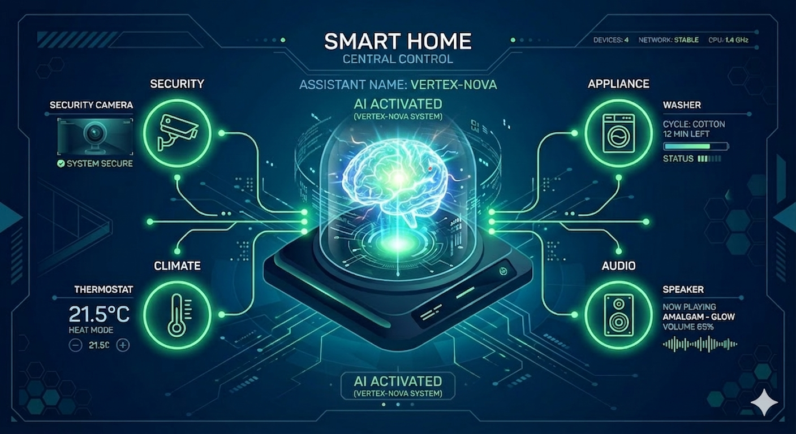
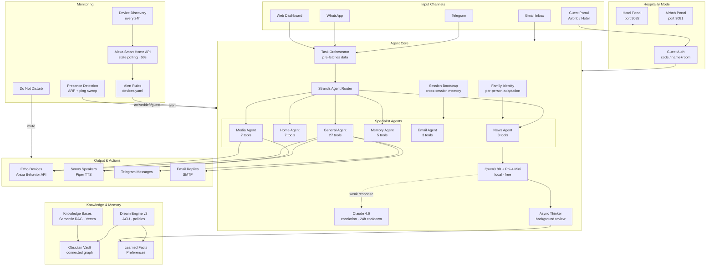
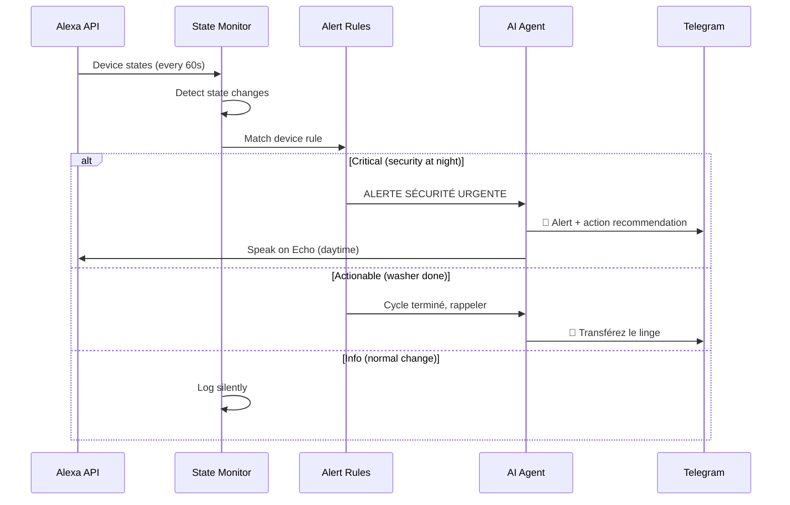
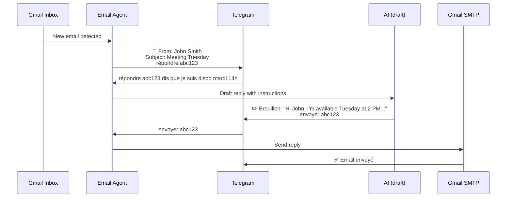

# Vertex Nova

<p align="center">
  
</p>

<p align="center">
  A self-hosted, multi-agent home assistant powered by local AI.<br/>
  Monitors your smart home, manages your emails, talks on your Echo and Sonos, and learns about you over time.
</p>

---

## Architecture


```mermaid
graph TB
    subgraph Input["Input Channels"]
        TG[Telegram]
        WA[WhatsApp]
        WEB[Web Dashboard]
        GUEST[Guest Portal<br/>Airbnb / Hotel]
        EMAIL_IN[Gmail Inbox]
    end

    subgraph Core["Agent Core"]
        ORCH[Task Orchestrator<br/>pre-fetches data]
        ROUTER[Strands Agent Router]
        subgraph Agents["Specialist Agents"]
            NEWS[News Agent<br/>3 tools]
            HOME[Home Agent<br/>7 tools]
            MEDIA[Media Agent<br/>7 tools]
            MEM[Memory Agent<br/>5 tools]
            EMAIL[Email Agent<br/>3 tools]
            GEN[General Agent<br/>27 tools]
        end
        OLLAMA[Qwen3 8B + Phi-4 Mini<br/>local · free]
        CLAUDE[Claude 4.6<br/>escalation · 24h cooldown]
        THINKER[Async Thinker<br/>background review]
        IDENTITY[Family Identity<br/>per-person adaptation]
        BOOTSTRAP[Session Bootstrap<br/>cross-session memory]
    end

    subgraph Output["Output & Actions"]
        ECHO[Echo Devices<br/>Alexa Behavior API]
        SONOS[Sonos Speakers<br/>Piper TTS]
        TG_OUT[Telegram Messages]
        EMAIL_OUT[Email Replies<br/>SMTP]
    end

    subgraph Monitor["Monitoring"]
        ALEXA_API[Alexa Smart Home API<br/>state polling · 60s]
        DISCOVER[Device Discovery<br/>every 24h]
        RULES[Alert Rules<br/>devices.yaml]
        PRESENCE[Presence Detection<br/>ARP + ping sweep]
        DND[Do Not Disturb]
    end

    subgraph Knowledge["Knowledge & Memory"]
        VAULT[Obsidian Vault<br/>connected graph]
        KB[Knowledge Bases<br/>Semantic RAG · Vectra]
        DREAM[Dream Engine v2<br/>ACU · policies]
        MEMORIES[Learned Facts<br/>Preferences]
    end

    subgraph Hospitality["Hospitality Mode"]
        AIRBNB[Airbnb Portal<br/>port 3081]
        HOTEL[Hotel Portal<br/>port 3082]
        GUESTAUTH[Guest Auth<br/>code / name+room]
    end

    TG --> ORCH
    WA --> ORCH
    WEB --> ORCH
    GUEST --> GUESTAUTH
    GUESTAUTH --> Core
    EMAIL_IN --> Core

    ORCH --> ROUTER
    ROUTER --> NEWS & HOME & MEDIA & MEM & GEN
    Agents --> OLLAMA
    OLLAMA -.->|weak response| CLAUDE
    OLLAMA --> THINKER
    IDENTITY --> Agents
    BOOTSTRAP --> Agents

    GEN --> ECHO & SONOS & TG_OUT & EMAIL_OUT
    MEDIA --> ECHO & SONOS

    ALEXA_API --> RULES
    DISCOVER --> ALEXA_API
    RULES -->|alert| Core
    PRESENCE -->|arrived/left/guest| Core
    DND -->|mute| Output

    DREAM --> VAULT & MEMORIES
    KB --> VAULT
    THINKER --> MEMORIES

    AIRBNB --> Hospitality
    HOTEL --> Hospitality
```

## Quick Start

```bash
curl -fsSL https://raw.githubusercontent.com/sdpoueme/vertex-nova/main/install.sh | bash
```

Or manually: `git clone`, `npm install`, `cp .env.home.example .env`, edit credentials, `npm start`.
Full guide: [docs/INSTALL.md](docs/INSTALL.md).

## Features

| Feature | Description |
|---------|-------------|
| Multi-Agent System | 7 specialist agents (news, home, media, memory, email, weather, general) via Strands SDK |
| Telegram & WhatsApp | Text, voice (whisper.cpp with hallucination filtering), images (two-stage vision pipeline) |
| Web Dashboard | HTTPS, multimodal chat with voice mode, persistent sessions, profile selector, config editor |
| Hospitality Mode | Airbnb + Hotel guest portals on dedicated ports, guest auth, multi-language concierge |
| Family Identity | Per-person agent conscience — adapts tone, notifications, recommendations per family member |
| Echo Devices | Native Alexa Behavior API — speak directly on any Echo, auto-discovered |
| Sonos TTS | Piper TTS (offline FR/EN), auto token refresh, time-based room routing |
| Email Agent | Inbox monitoring, Telegram notifications, AI-drafted replies, compose new emails, SMTP |
| Smart Home Monitor | Alexa API device discovery + state polling, context-driven alert rules per device |
| Presence Detection | Per-person WiFi tracking via ARP + ping sweep, configurable thresholds, vacation mode, DND |
| Guest Detection | Welcomes unknown phones/tablets on WiFi with Sonos greeting |
| Task Orchestrator | Pre-fetches news/weather/movies for device requests (1 AI call instead of 3+) |
| Async Thinker | Background agent reviews every response and saves learnings |
| Session Bootstrap | Cross-session memory — agent remembers yesterday's context automatically |
| Knowledge Bases | Git repos + URL crawling, semantic RAG with local embeddings (Ollama + Vectra) |
| Image Queue | Failed vision requests saved to disk, auto-retried when Claude comes back online |
| Dream Engine | Nightly self-improvement: Dream Layer v2 (ACU, controlled hallucination, policy proposals), graph consolidation |
| Model Manager | Pull, delete, hot-swap AI models from the dashboard without restart |
| Movie Recommendations | TMDB + NYT, multi-language, scored by user genre preferences |
| Proactive Actions | Scheduled news, weather, maintenance, movies — multi-model (Phi-4 for SKIP logic) |
| Night Mode | Voice devices blocked 10 PM – 7 AM, auto-routes to Telegram |
| Do Not Disturb | Mute all notifications via Telegram, dashboard, or API |
| Claude Cooldown | 24h cooldown on credit errors, persisted to disk across restarts |

## Smart Home Monitoring

Devices are discovered automatically via the Alexa Smart Home API every 6 hours. The agent polls device states every 60 seconds and applies user-defined alert rules.


```mermaid
sequenceDiagram
    participant Alexa as Alexa API
    participant Monitor as State Monitor
    participant Rules as Alert Rules
    participant AI as AI Agent
    participant User as Telegram

    Alexa->>Monitor: Device states (every 60s)
    Monitor->>Monitor: Detect state changes
    Monitor->>Rules: Match device rule
    alt Critical (security at night)
        Rules->>AI: ALERTE SÉCURITÉ URGENTE
        AI->>User: 🚨 Alert + action recommendation
        AI->>Alexa: Speak on Echo (daytime)
    else Actionable (washer done)
        Rules->>AI: Cycle terminé, rappeler
        AI->>User: 👕 Transférez le linge
    else Info (normal change)
        Monitor->>Monitor: Log silently
    end
```

Each device rule includes an AI context field — specific instructions for what the agent should do when that device changes state. Examples:

| Device | Rule |
|--------|------|
| 🔒 Security Panel | Night disarm = urgent alert. Repeated arm/disarm = suspicious. |
| 📹 Backyard Camera | Night motion = immediate alert. Weekday day = probably delivery, skip. |
| 👕 Washer | Cycle done → remind to transfer. No dryer activity in 30 min → second reminder. |
| 🧊 Fridge | Temp > 8°C = urgent. Suggest checking door, offer to draft email to Bosch support. |
| 🍳 Oven | On > 2 hours → reminder. On after 11 PM → safety alert. |
| 🔌 Front Door Socket | Off at night → suggest turning on for security. |

## Presence Detection

Tracks who's home by scanning the local network for known phone MAC addresses. Each person has their own welcome preferences, language, and notification settings.

- **Per-person config** in `config/presence.yaml`: language, welcome style, welcome device (Sonos/Echo), notification preference (Telegram, voice, or both)
- ARP table polling every 30 seconds + ping sweep every ~2.5 minutes (works with mesh WiFi pods)
- Smart thresholds: 15 minutes during day, 60 minutes at night to avoid false positives from phone sleep mode
- Requires 2 consecutive missed polls before marking as "left"
- Night suppression: departures during night hours are logged silently (no notification)
- Morning check: if someone "left" at night and hasn't returned by 7 AM → alert
- Travel detection: after 6 hours away → asks "are you traveling?" via Telegram
- Vacation mode: auto-enables when all residents away 24h+, enhanced security monitoring. Can also be toggled manually from the dashboard or via Telegram ("oui voyage" / "fin voyage")
- Arrival: notification per person's preference + AI welcome greeting on their configured device
- All thresholds (day/night away time, night hours, travel ask delay, vacation delay, consecutive misses) are tunable from the dashboard
- Dashboard widget with real-time presence + vacation mode toggle
- AI tool `who_is_home` for conversational queries

Configure in the dashboard (Configuration → Détection de présence) or `config/presence.yaml`:
```yaml
settings:
  poll_seconds: 30
  day_away_minutes: 15
  night_away_minutes: 60
  consecutive_misses: 2
  travel_ask_hours: 6
  vacation_hours: 24
  night_start: 23
  night_end: 7

people:
  - name: Alice
    mac: aa:bb:cc:dd:ee:ff
    language: fr
    welcome_style: briefing        # simple, briefing, activity_summary
    welcome_room: Living Room      # Sonos room or echo:Device Name
    notifications: both            # telegram, voice, both
```
Get MAC addresses from `arp -a` or your router admin page. For phones using randomized MACs (iOS/Android), use the WiFi-specific MAC shown in the phone's WiFi settings.

Backward compatible: if `config/presence.yaml` doesn't exist, falls back to `PRESENCE_DEVICES` env var.

## Knowledge Bases

Two types of knowledge bases, configurable from the dashboard:

| Type | Source | How it works |
|------|--------|-------------|
| Git repo | GitHub/GitLab URL | Clones repo, extracts text from HTML/JSON/MD, relationship-aware for genealogy |
| URL collection | List of websites | Discovers pages via sitemap.xml (or link extraction fallback), fetches up to 50 pages/site, runs in background worker process |

URL crawling runs in a child process to avoid blocking the main event loop.

### Vault Graph Structure

All vault content follows a connected graph schema with `vertex-nova` as the central node. Knowledge bases are grouped by category:

| Category | KBs | Linked to |
|----------|-----|-----------|
| **Personal** | `owner-profile`, `family-member` | Person nodes (`owner`, family) |
| **Home** | `home-maintenance-seasonal`, `home-resources`, `home-safety-energy`, `House-homevalue`, `appliance-maintenance` | Home node |

Each KB directory has an index note (`kb-<name>.md`) that connects it to the `knowledge-bases` super-node and the appropriate owner (person or home). Raw crawled pages don't need individual wikilinks — they're connected through their directory's index note.

### Graph Consolidation

A nightly process (during the dream cycle) scans the vault for orphan notes (files without any `[[wikilinks]]`) and automatically connects them to the graph based on their directory. This ensures the Obsidian graph view stays fully connected without manual intervention.

### Semantic RAG Pipeline

Knowledge base search uses a full RAG pipeline with local embeddings:

| Stage | What it does | Technology |
|-------|-------------|-----------|
| Extract | Chunk documents (500 words, 50 overlap) | Custom chunker |
| Embed | Generate 768-dim vectors | Ollama `nomic-embed-text` (274 MB, local) |
| Store | Persist vectors to disk | Vectra (file-based vector DB) |
| Retrieve | Semantic similarity search (top-10) | Cosine similarity |
| Rerank | LLM relevance scoring (top-5) | Qwen3 8B |

The index builds gradually in the background (throttled to avoid CPU spikes). Falls back to keyword search if RAG is unavailable.

```
                    knowledge-bases
                   /       |       \
          personal/     home-KBs    \
         /       \     /    |    \   \
   kb-owner  kb-family  maintenance  safety  homevalue
        \       /          \     |      /
         owner              \    |     /
           ↕                 \   |    /
    vertex-nova ←————————————→ home
       ↕    ↕                   ↕
  family    dreams          devices
       ↕       ↕            /   |   \
  presence  daily-logs   sonos echo smart-home
               ↕
         weekly-summaries
```

## Email Agent


```mermaid
sequenceDiagram
    participant Gmail as Gmail Inbox
    participant Agent as Email Agent
    participant User as Telegram
    participant AI as AI (draft)
    participant SMTP as Gmail SMTP

    Gmail->>Agent: New email detected
    Agent->>User: 📧 From: John Smith<br/>Subject: Meeting Tuesday<br/>répondre abc123
    User->>Agent: répondre abc123 dis que je suis dispo mardi 14h
    Agent->>AI: Draft reply with instructions
    AI->>User: ✏️ Brouillon: "Hi John, I'm available Tuesday at 2 PM..."<br/>envoyer abc123
    User->>Agent: envoyer abc123
    Agent->>SMTP: Send reply
    SMTP->>User: ✅ Email envoyé
```

## Two-Stage Vision Pipeline

When you send an image:
1. **Vision Agent** (Gemma 4 E2B) analyzes the image → produces a text description (~10-30s)
2. **Text Agent** (Qwen3 8B) interprets the description and takes action if needed
3. Both results are combined and returned

If the user requests an action ("analyse ce plan et sauvegarde-le"), Stage 2 uses tools (vault, email, reminders). For simple analysis ("décris cette image"), only Stage 1 runs.

If both Claude and the local vision model fail, the request is queued to disk and auto-retried every 15 minutes.

## Anti-Hallucination

The system prompt explicitly forbids inventing content: "N'INVENTE JAMAIS de contenu. Pour les films, actualités, météo: utilise TOUJOURS les outils." This prevents the AI from generating fake movie titles, fake news, or fake data instead of calling the appropriate tool.

A degeneration detector catches repeated word loops (a known Qwen3 bug) and truncates the response to the first coherent sentences.

## Cookie Expiry Handling

When Alexa cookies expire, the agent automatically:
1. Detects the 401/403 error
2. Stops device polling
3. Sends you a Telegram message with the cookie format
4. When you paste the new cookies, updates `.env` and restarts monitoring

## AI Tools (27)

| Category | Tools |
|----------|-------|
| Voice | `sonos_speak`, `sonos_chime`, `sonos_volume`, `sonos_rooms`, `echo_speak`, `echo_speak_all` |
| Search | `news_search`, `web_search`, `web_fetch`, `movie_recommend` |
| Vault | `vault_read`, `vault_search`, `vault_create`, `vault_append`, `vault_list` |
| Memory | `memory_view`, `memory_write`, `memory_append`, `reminder_set`, `reminder_list` |
| Knowledge | `kb_search`, `kb_list` |
| Email | `email_list`, `email_draft`, `email_send`, `email_compose` |
| Presence | `who_is_home` |

## Web Dashboard

Served over HTTPS (auto-generated self-signed cert). Access: `https://<your-ip>:3080`

| Panel | Features |
|-------|----------|
| Accueil | Live device status, presence widget, channels, KBs, recent interactions |
| Chat | Text, image, voice, persistent sessions with history picker, profile selector, voice mode |
| Configuration | AI models + model manager (pull/delete/swap), Sonos/Echo routing, per-person presence, family identity, hospitality modes, home location, news, movies, Alexa cookies, Telegram |
| Appareils | Alexa device discovery with capabilities, alert rule editor with device picker |
| Connaissances | Git repos + URL collections, semantic RAG, sitemap crawling, sync per KB |
| Logs | Live tail of agent logs |

## Offline Capability

Everything runs locally without any cloud API:

| Feature | Local Stack |
|---------|------------|
| Text chat | Qwen3 8B (Ollama) |
| Voice input | whisper.cpp |
| Voice output | Piper TTS → Sonos |
| Image analysis | Gemma 4 E2B (Ollama) → Qwen3 8B for follow-up actions |
| Search | DuckDuckGo / Google News RSS |
| All 27 tools | Work on Qwen3 via Strands |

Claude is only used for escalation when the local model gives a weak response. On credit errors, it enters a 24-hour cooldown persisted to disk — no wasted API calls across restarts.

## Dream Layer v2

Nightly self-improvement system based on [Cheung (2026) "Dreaming Is Not a Bug"](https://arxiv.org/pdf/2601.06115). Runs during quiet hours (1-5 AM) when idle.

| Phase | What it does |
|-------|-------------|
| 1-5 | Original: conversation review, memory consolidation, escalation analysis, tomorrow prep, weekly summary |
| Graph | Consolidates the vault graph — connects orphan notes |
| 6 | Extracts Interaction Templates from daily logs → ACU (Artificial Collective Unconscious) |
| 7 | Generates Dream Narratives from templates (two-pass: divergent → refined) + edge case scenarios |
| 8 | Interprets dreams for recurring motifs → proposes policy updates |

**Safety:** All dream content tagged `[DREAM]`, blocked from live responses. Local model only (zero Claude spend). Ephemeral dreams auto-expire (14 days). Policy updates require manual approval.

**Commands:** `dream status`, `dream policies`, `dream now`, `approve policy <id>`, `reject policy <id>`

**Config:** `config/dream-layer.yaml`

## Session Bootstrap

Cross-session memory persistence. On each new session, the agent automatically loads:
- Last session summary
- Pending reminders and emails
- Recent dream learnings
- Identity facts (user preferences, patterns)
- Current home state (presence, vacation mode)

This solves the "blank slate every morning" problem — the agent remembers yesterday's context.

## Do Not Disturb

Mutes all proactive notifications and voice output while keeping the agent running.

- **Telegram:** `mute` / `unmute`
- **Dashboard:** toggle in the presence section
- **API:** `PUT /api/dnd {"enabled": true}`

Direct chat still works normally when muted.

## Hospitality Mode

Transforms Vertex Nova into a guest concierge for short-term rentals.

| Mode | Port | Auth | Use case |
|------|------|------|----------|
| Résidence | 3080 | — | Normal family mode (default) |
| Airbnb | 3081 | 6-char code (emailed) | Entire home or private room rental |
| Hôtel | 3082 | Name + room number | Multi-room with individual guests |

**Features:**
- Separate guest portal on dedicated port (isolated from admin)
- Guest sees only: WiFi info, house rules, emergency contacts, local info, limited chat
- Guest does NOT see: family data, emails, security, configuration, logs
- Multi-language: agent auto-detects guest language and responds accordingly
- Access code auto-expires at checkout, admin can revoke anytime
- Guest history preserved with privacy (anonymized after 30 days)
- Dream engine disabled in hospitality modes
- IoT presence detection via Matter + WiFi sensors (planned)
- Guest can control audio and lights only (planned)

**Admin workflow:**
1. Switch to Airbnb/Hotel mode in dashboard (Configuration → Hospitalité)
2. Configure guest details in `config/hospitality.yaml`
3. Generate access code → sent to guest by email
4. Guest accesses portal on dedicated port, enters code
5. At checkout, code expires automatically

## Family Identity

Per-person agent conscience — adapts all interactions based on who's talking.

Configure in dashboard (Configuration → Famille) or `config/family.yaml`:
- Communication style (warm/concise/formal)
- Briefing depth (full/summary/minimal)
- Proactive notification level and rules per category
- Daily schedule (morning, work, evening, sleep hours)
- Interests (for recommendation filtering)
- Channel preferences

## Configuration

| File | Purpose |
|------|---------|
| `.env` | All credentials and settings |
| `agent.md` | Agent persona, rules, capabilities, household info |
| `config/routing.yaml` | Model routing rules |
| `config/proactive.yaml` | Scheduled proactive actions (multi-model) |
| `config/knowledgebases.yaml` | Knowledge base git repos and URLs |
| `config/devices.yaml` | Device alert rules |
| `config/presence.yaml` | Per-person presence detection settings and thresholds |
| `config/family.yaml` | Family identity — per-person style, schedule, notifications |
| `config/hospitality.yaml` | Hospitality modes (Airbnb/Hotel), guest config, rooms |
| `config/dream-layer.yaml` | Dream Layer v2 parameters (templates, generation, policies, scenarios) |

## Installation

See [docs/INSTALL.md](docs/INSTALL.md) for the full guide.

Prerequisites: Node 20+, Ollama, ffmpeg, openssl.
Optional: Piper TTS (Sonos voice), whisper.cpp (voice messages).

```bash
npm install
ollama pull qwen3:8b
cp .env.home.example .env  # Edit with your credentials
npm start
# Dashboard at https://localhost:3080
```

## License

MIT
